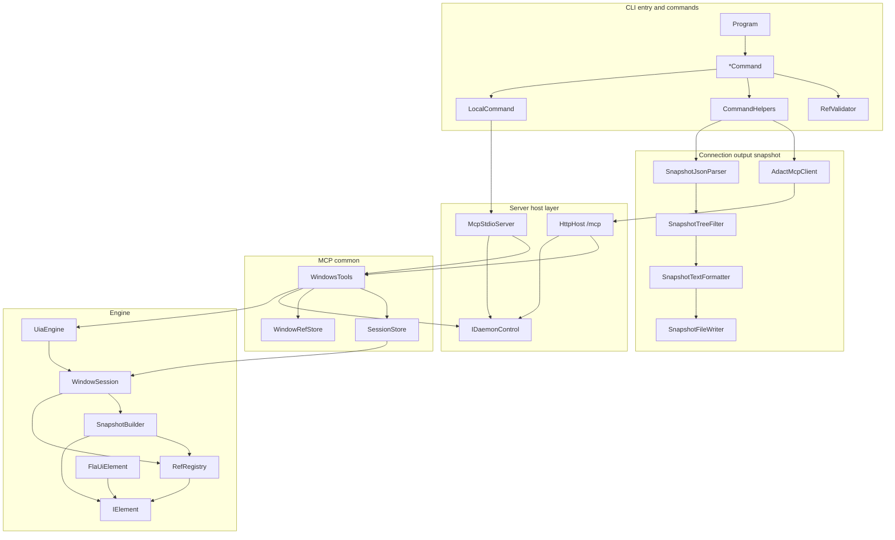

# Class Responsibilities

この文書は、ADACT の主要クラスを「どの状態を持つか」「何を呼ぶか」「何を返すか」という設計観点で整理します。CLI 仕様や MCP tool の入出力そのものは [../spec/cli.md](../spec/cli.md)、[../spec/mcp-tools.md](../spec/mcp-tools.md) を参照してください。

## 全体の層

| 層 | 主な責務 | 状態の持ち方 |
| --- | --- | --- |
| CLI entry / command layer | `adact <subcommand>` の定義、引数検証、MCP tool 呼び出し、CLI 出力への変換 | 原則として短命。永続状態は持たない |
| Connection / output / snapshot layer | daemon 接続先解決、MCP client、stdout/stderr 整形、CLI `.txt` snapshot 生成 | 接続中の `McpClient` と一時的な変換結果 |
| Server host layer | HTTP / stdio MCP server の起動、DI 構成、daemon 停止の抽象化 | process lifetime の singleton を DI で保持 |
| MCP common layer | `windows_*` tool 実装、session/window ref 管理、Engine 例外の tool error 化 | daemon process 内の `SessionStore` / `WindowRefStore` |
| Engine layer | UIA 操作の実体、window session、snapshot raw JSON、element ref 解決 | `UiaEngine` と各 `WindowSession` が UIA / ref 状態を保持 |

## CLI entry / command layer

| 型 | 何を持つか | 何を呼ぶか | 何を返すか |
| --- | --- | --- | --- |
| `Program` | `RootCommand` の構築ロジック | 各 `*Command.Build()`、`Parse(args)`、`InvokeAsync()` | process exit code |
| `ListAppsCommand` | `--server` option | `CommandHelpers.RunWithClientAsync()`、MCP `windows_list_apps`、`TsvWriter` | window 一覧 TSV と exit code |
| `AttachCommand` | positional `ref`、条件指定 option、`--no-snapshot`、`--snapshot-dir`、`--server` | `RefValidator`、MCP `windows_attach`、成功時に `CommandHelpers.WriteSnapshotResultAsync()` | `sessionId` / `windowRef` / snapshot path |
| `SnapshotCommand` | `--sid`、`--snapshot-dir`、`--filter`、`--server` | `CommandHelpers.WriteSnapshotResultAsync()` | `sessionId` と CLI `.txt` snapshot path |
| `ClickCommand` | element ref、`--no-snapshot`、`--snapshot-dir`、`--server` | `RefValidator`、`CommandHelpers.RunRefOperationAndAutoSnapshotAsync()`、MCP `windows_click` | 操作後 snapshot path、または `sessionId` のみ |
| `FillCommand` | element ref、text、`--no-snapshot`、`--snapshot-dir`、`--server` | `RefValidator`、`CommandHelpers.RunRefOperationAndAutoSnapshotAsync()`、MCP `windows_fill` | 操作後 snapshot path、または `sessionId` のみ |
| `DetachCommand` / `CloseCommand` / `KillCommand` | `--sid`、`--server` | `LifecycleCommandImpl.ExecuteAsync()` と対応 MCP tool | `sessionId` と `detached` / `closed` / `killed` の literal 行 |
| `CloseAllCommand` | `--server` | MCP `windows_close_all`、`FormatResults()` | session ごとの TSV 風結果。失敗があれば exit 1 |
| `DaemonStopCommand` | `--server` | `ConnectionResolver`、localhost guard、MCP `daemon_stop` | `stopped`。応答前切断も停止済みとして成功扱い |
| `ServeCommand` | `--port` | `HttpHost.RunAsync()` | HTTP daemon の process exit code |
| `LocalCommand` | `--verbose` | `LoggerFactoryHelper`、`McpStdioServer.RunAsync()` | stdio MCP server の process exit code |
| `InstallCommand` | `--skills`、`--global`、client 別 install path matrix | output 配下の `Skills/adact-cli` 探索、directory copy | install 先 path と exit code |
| `CommandHelpers` | 共通 option と共通実行関数 | `ConnectionResolver`、`AdactMcpClient`、`McpResponse`、snapshot 変換層 | コマンド別 exit code |
| `RefValidator` | `w<n>` / `s<n>` / `s<n>e<n>` の regex | CLI 入力検証、element ref から sessionId 抽出 | bool または `sessionId` |

CLI command は、引数を検証して MCP tool 名と arguments を決める薄い層です。daemon 側に保持される session/ref 状態を CLI process に持ち帰らないため、複数回の CLI 実行をつなぐ状態は HTTP daemon process 内にあります。

## Connection / output / snapshot layer

| 型 | 何を持つか | 何を呼ぶか | 何を返すか |
| --- | --- | --- | --- |
| `ConnectionResolver` | 既定 URL と接続先解決順序 | `ServerEndpoint.Parse()`、`ConfigLoader.FindServerFromConfig()` | 解決済み `ServerEndpoint` |
| `ConfigLoader` | `.adact/config.json` の探索規則 | file IO、JSON deserialize | `server` 文字列または null |
| `ServerEndpoint` | `Uri Url`、`IsLocalhost` | URL parse、localhost 判定 | HTTP/HTTPS の有効な接続先オブジェクト |
| `AdactMcpClient` | MCP SDK の `McpClient` と `Endpoint` | HTTP Streamable transport、`CallToolAsync()` | `CallToolResult` |
| `McpResponse` | 状態は持たない | `CallToolResult` の structured/text JSON 抽出、`CliError` | `JsonElement` または CLI exit code |
| `KeyValueWriter` | 状態は持たない | `Console.Out` | `key value` 行 |
| `TsvWriter` | 状態は持たない | `Console.Out` | header 付き TSV 行 |
| `CliError` | error code、message、hint の record 形 | `Console.Error` | stderr key-value 行 |
| `SnapshotJsonParser` | 状態は持たない | raw snapshot JSON parse | `SnapshotMeta` と `SnapshotElement` tree |
| `SnapshotTreeFilter` | filter 名、ControlType の採用規則 | parsed tree の再帰処理 | `operable` または `raw` の中間 tree |
| `SnapshotTextFormatter` | 状態は持たない | frontmatter と tree 行の整形 | Playwright 風 `.txt` snapshot 文字列 |
| `SnapshotFileWriter` | 既定出力先 `.adact/` と filename 規則 | directory 作成、UTF-8 file write | CWD からの slash 区切り相対 path |

snapshot は daemon から raw JSON として返り、CLI 側で人間と AI が読みやすい `.txt` に変換されます。この境界により MCP tool は情報を落とさず、CLI は用途に合わせて `operable` / `raw` を選べます。

## Server host layer

| 型 | 何を持つか | 何を呼ぶか | 何を返すか |
| --- | --- | --- | --- |
| `HttpHost` | `/mcp` path、対話 session guard、ASP.NET Core / MCP SDK の DI 構成 | `InteractiveSessionGuard.Probe()`、`UiaEngine` / stores / `WindowsTools` の登録、Kestrel 起動 | daemon exit code |
| `HttpDaemonControl` | `IHostApplicationLifetime` | `StopApplication()` | `daemon_stop` 用の停止完了 task |
| `McpStdioServer` | stdio transport の DI 構成、対話 session guard | `InteractiveSessionGuard.Probe()`、`UiaEngine` / stores / `WindowsTools` の登録、host 起動 | stdio server exit code |
| `StdioDaemonControl` | `IsSupported=false` | 呼び出し時に例外 | stdio では `daemon_stop` 非対応であること |

HTTP と stdio は transport が違うだけで、どちらも同じ `WindowsTools`、`SessionStore`、`WindowRefStore`、`UiaEngine` を DI に登録します。CLI 主経路で使うのは HTTP daemon です。

## MCP common layer

| 型 | 何を持つか | 何を呼ぶか | 何を返すか |
| --- | --- | --- | --- |
| `WindowsTools` | `SessionStore`、`WindowRefStore`、`IDaemonControl`、logger | `UiaEngine`、`WindowSession`、stores、`ToolErrors` | MCP `CallToolResult` |
| `SessionStore` | `UiaEngine`、`s<n>` -> `WindowSession`、active session、tool-level lock | session 登録/削除/検索、ref から session 解決 | `WindowSession` または session 一覧 |
| `WindowRefStore` | `WindowKey` -> `WindowRefEntry`、次の `w<n>` 番号 | list-apps との同期、retire、session 関連付け | `windowRef` entry |
| `WindowKey` | HWND、processId、processStartTime | `WindowInfo` から process start time 取得 | top-level window の識別キー |
| `ToolErrors` | MCP error code 定数 | Engine 業務例外の pattern matching | `isError:true` の `CallToolResult` |
| `IDaemonControl` | daemon stop capability | HTTP / stdio 実装に委譲 | stop task、または非対応状態 |

`WindowsTools` は MCP tool の境界です。ここで `SessionStore.AcquireAsync()` を取り、tool 呼び出し単位で UIA 操作を直列化します。Engine からの業務例外は `ToolErrors` で MCP error に変換し、想定外の例外は SDK 側の internal error に流します。

## Engine layer

| 型 | 何を持つか | 何を呼ぶか | 何を返すか |
| --- | --- | --- | --- |
| `UiaEngine` | `UIA3Automation`、共有 `SemaphoreSlim`、次の session 番号、logger | desktop window 列挙、`FromHandle()`、`WindowSession` 作成 | `WindowInfo` 一覧、`WindowSession` |
| `WindowSession` | 対象 `Window`、root `IElement`、`RefRegistry`、共有 gate、process/window metadata | `SnapshotBuilder`、`RefRegistry.Resolve()`、`IElement.Click()` / `Fill()`、close/kill | `SnapshotResult`、操作完了 task |
| `InteractiveSessionGuard` | 対話 desktop 判定規則 | process `SessionId`、Window Station 名取得 | 起動可否と diagnostic message |
| `IElement` | UIA element の抽象プロパティと操作 API | 実装に委譲 | property 値、children、click/fill 操作 |
| `FlaUiElement` | FlaUI `AutomationElement`、lazy children cache | FlaUI property / pattern / input API | `IElement` としての値と操作 |
| `SnapshotBuilder` | session の `RefRegistry` | `SnapshotBuildInput` の root / modal tree を DFS | raw JSON と `sessionId` |
| `RefRegistry` | sessionId、stable key -> eid、current snapshot の eid -> `IElement` | `RefId`、`IElement.RuntimeId`、positional fallback | stable な `elementRef` と current element 解決 |
| `RefId` | 状態は持たない | `s<sid>e<eid>` format / parse | ref 文字列、または parsed id |
| `SnapshotBuildInput` | root window、modal siblings、options、window/process metadata、generatedAt | `SnapshotBuilder.Build()` に渡される | raw snapshot 構築入力 |

Engine は UIA 操作の不安定さを吸収する層です。`UiaEngine` と `WindowSession` は同じ gate を共有し、window 列挙、attach、snapshot、click、fill、close、kill を daemon process 内で 1 本ずつ実行します。

## 依存方向

この節では、`ProjectReference` による build-time dependency と、実行時の runtime call flow / 設計上の呼び出し依存を分けて扱います。

### ProjectReference / build-time dependency

| From | To | 用途 | 逆方向依存 |
| --- | --- | --- | --- |
| `Adact.Cli` | `Adact.Cli.Server` | `adact serve` から HTTP host を起動 | なし |
| `Adact.Cli` | `Adact.Engine` | 現行 csproj 上の参照。通常 CLI client 操作の主経路では直接呼ばない | なし |
| `Adact.Cli` | `Adact.Mcp.Common` | 現行 csproj 上の参照。通常操作の主経路は HTTP MCP 経由 | なし |
| `Adact.Cli` | `Adact.Mcp.Stdio` | `adact local` から stdio server を起動 | なし |
| `Adact.Cli.Server` | `Adact.Mcp.Common` | HTTP transport に `WindowsTools` を登録 | なし |
| `Adact.Cli.Server` | `Adact.Engine` | `UiaEngine` を DI singleton として提供 | なし |
| `Adact.Mcp.Stdio` | `Adact.Mcp.Common` | stdio transport に `WindowsTools` を登録 | なし |
| `Adact.Mcp.Stdio` | `Adact.Engine` | `UiaEngine` を DI singleton として提供 | なし |
| `Adact.Mcp.Common` | `Adact.Engine` | window/session 操作と Engine 例外変換 | なし |

### Runtime call flow / design dependency

| From | To | 用途 |
| --- | --- | --- |
| CLI command | `AdactMcpClient` | 引数検証後、MCP tool 名と arguments を渡す |
| `AdactMcpClient` | HTTP daemon (`Adact.Cli.Server`) | HTTP transport で tool を呼び出す |
| HTTP daemon | `WindowsTools` (`Adact.Mcp.Common`) | MCP tool 実装へ dispatch する |
| `WindowsTools` | `Adact.Engine` | window/session 操作と Engine 例外変換 |
| `Adact.Engine` | FlaUI / Win32 | UIA と native window 操作 |

通常の CLI client サブコマンドの主経路は、CLI source が Engine を直接呼ぶのではなく、`AdactMcpClient` -> HTTP daemon -> `WindowsTools` -> Engine です。`Adact.Cli -> Adact.Mcp.Common` は build-time dependency として存在しますが、通常操作の設計上の主経路は HTTP MCP 経由です。Engine は MCP や CLI 出力形式を知らず、raw な UIA 操作と snapshot JSON の生成に閉じています。

## 関連文書

| 文書 | 内容 |
| --- | --- |
| [components.md](components.md) | project 単位の概要 |
| [command-flows.md](command-flows.md) | サブコマンド実行時の処理フロー |
| [snapshot-pipeline.md](snapshot-pipeline.md) | snapshot 生成と ref の詳細 |
| [../spec/ref-ids.md](../spec/ref-ids.md) | ref ID の仕様 |