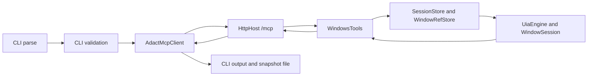
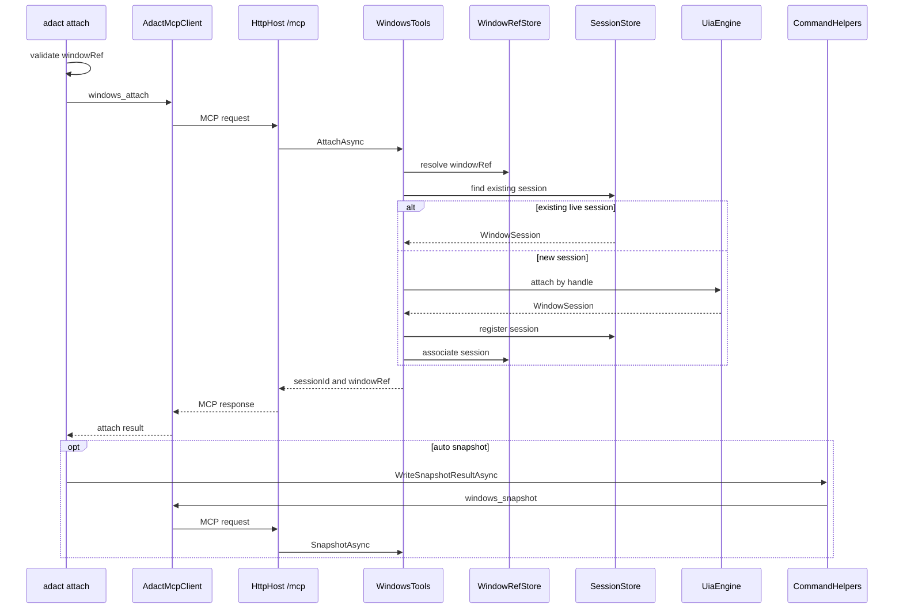
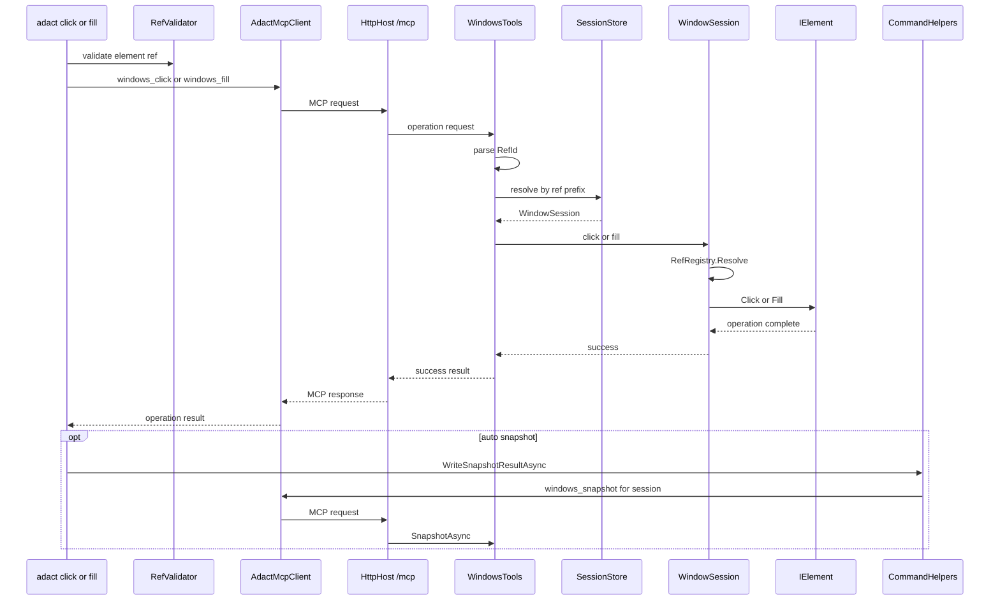
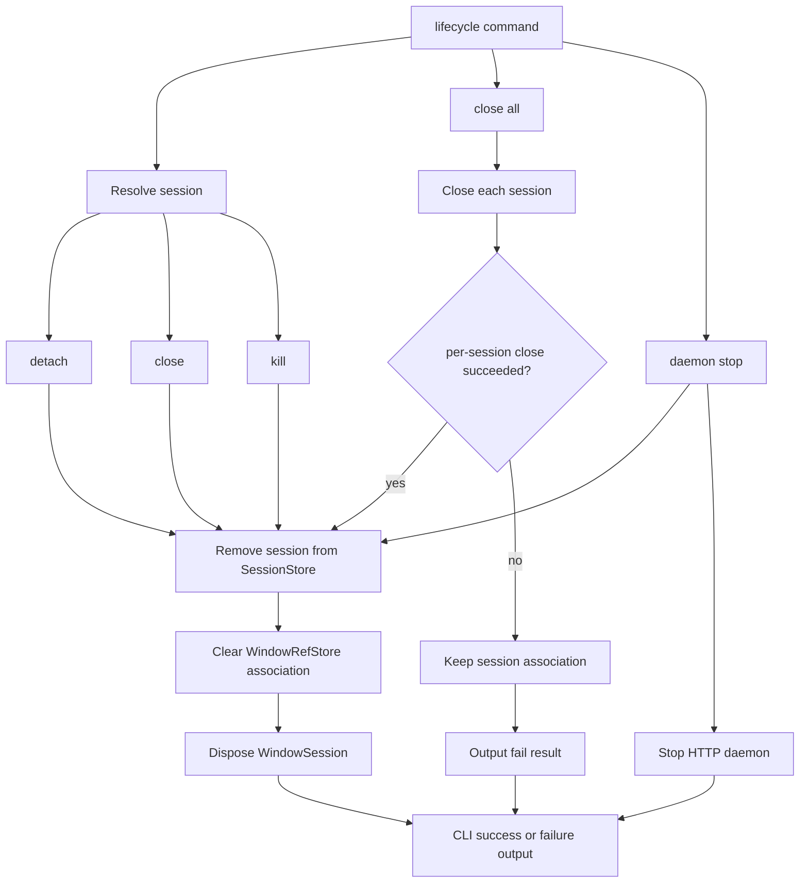

# Command Flows

この文書は、`adact <subcommand>` が CLI から MCP tool、store、Engine、CLI 出力へ進む処理フローを説明します。入出力形式のカタログは [../spec/cli.md](../spec/cli.md) と [../spec/mcp-tools.md](../spec/mcp-tools.md) を参照してください。

## 共通フロー

多くの CLI subcommand は次の形で動きます。

| 段階 | 主な型 | 役割 |
| --- | --- | --- |
| 1. CLI parse | `Program`, 各 `*Command` | subcommand と option / argument を解釈する |
| 2. CLI validation | 各 `*Command`, `RefValidator` | 接続前に分かる入力エラーを `CliError` で返す |
| 3. connection | `CommandHelpers`, `ConnectionResolver`, `AdactMcpClient` | `--server` / `.adact/config.json` / default から接続先を決め、HTTP MCP daemon に接続する |
| 4. HTTP MCP daemon | `HttpHost` | `/mcp` で MCP request を受け、`WindowsTools` へ dispatch する |
| 5. MCP tool | `WindowsTools` | `windows_*` または `daemon_stop` を実行する |
| 6. store | `SessionStore`, `WindowRefStore` | active session、`s<n>`、`w<n>`、session と window の関連を管理する |
| 7. Engine | `UiaEngine`, `WindowSession` | UIA 操作、snapshot、click/fill、close/kill を実行する |
| 8. CLI output | `McpResponse`, `KeyValueWriter`, `TsvWriter`, snapshot 変換層 | MCP 結果を CLI の stdout/stderr へ変換する |

## `adact list-apps`

| 観点 | 内容 |
| --- | --- |
| CLI tool | `windows_list_apps` |
| daemon state | `WindowRefStore` を現在の top-level windows と同期 |
| Engine operation | `UiaEngine.ListWindowsAsync()` |
| CLI output | header 付き TSV |

1. `Program` が `ListAppsCommand` を起動します。
2. `ListAppsCommand` は `--server` を読み、`CommandHelpers.RunWithClientAsync()` に処理を渡します。
3. `ConnectionResolver` が接続先を解決し、`AdactMcpClient` が HTTP MCP daemon に接続します。
4. CLI は MCP `windows_list_apps` を呼びます。
5. `WindowsTools.ListAppsAsync()` は `SessionStore.AcquireAsync()` で tool-level lock を取り、`UiaEngine.ListWindowsAsync()` を呼びます。
6. `UiaEngine` は desktop 直下の visible / on-screen な Window を列挙し、`WindowInfo` 一覧を返します。
7. `WindowsTools` は各 window を `WindowKey` に変換し、`WindowRefStore.SyncOrAssign()` で `w<n>` を割り当てます。列挙から消えた window は `RetireMissing()` で retired になります。
8. MCP response は `windows` 配列として返ります。
9. CLI は `McpResponse.GetJson()` で JSON を取り出し、`TsvWriter` で `windowRef` / `sessionId` / process 情報を出力します。

## `adact attach`

`attach` は `windowRef` (`w<n>`) のみで対象 window を指定します。成功時には `SessionStore` に `WindowSession` を登録し、`WindowRefStore` に `windowRef` と `sessionId` の関連を持たせます。

### `windowRef` 指定

1. `AttachCommand` は positional `ref` が `w<n>` 形式かを `RefValidator.IsWindowRef()` で検証します。
2. CLI は MCP `windows_attach` に `windowRef` を渡します。
3. `WindowsTools.AttachAsync()` は `WindowRefStore.TryResolve()` で `w<n>` を現在有効な window に解決します。
4. entry に既存 `sessionId` があり、`SessionStore.TryGet()` で生きている session が見つかれば、新しい attach は行わず既存 `sessionId` / `windowRef` を返します。
5. 既存 session がなければ、`UiaEngine.AttachByHandleAsync()` が HWND から `WindowSession` を作成します。
6. `SessionStore.Register()` が `s<n>` を登録し active session にします。
7. `WindowRefStore.AssociateSession()` が `w<n>` と `s<n>` を結びます。
8. CLI は `sessionId` と `windowRef` を出力します。
9. `--no-snapshot` がなければ、続けて `CommandHelpers.WriteSnapshotResultAsync()` が `windows_snapshot` を呼び、snapshot path を出力します。

## `adact snapshot`

| 観点 | 内容 |
| --- | --- |
| CLI tool | `windows_snapshot` |
| session 解決 | `--sid` があれば指定 session、なければ active session |
| raw JSON | MCP response の `Content[0].Text` / `StructuredContent` |
| `.txt` 変換 | CLI 側の parser / filter / formatter / writer |

1. `SnapshotCommand` は `--sid`、`--filter`、`--snapshot-dir` を読みます。
2. `CommandHelpers.WriteSnapshotResultAsync()` が filter 名を検証し、MCP `windows_snapshot` を呼びます。
3. `WindowsTools.SnapshotAsync()` は `SessionStore` から対象 `WindowSession` を取得します。`sessionId` 省略時は active session を使います。
4. `WindowSession.SnapshotAsync()` が `SnapshotBuilder.Build()` を呼び、raw JSON を生成します。
5. MCP response は raw JSON を text と structured content の両方に載せて返します。
6. CLI は raw JSON を `SnapshotJsonParser` で中間 tree にし、`SnapshotTreeFilter` で `operable` / `raw` を適用し、`SnapshotTextFormatter` で `.txt` 文字列にします。
7. `SnapshotFileWriter` が `.adact/` または `--snapshot-dir` に保存します。
8. CLI は `sessionId` と snapshot path を stdout に出力します。

## `adact click` / `adact fill`

| 観点 | `click` | `fill` |
| --- | --- | --- |
| CLI validation | `s<n>e<n>` 形式 | `s<n>e<n>` 形式と text 必須 |
| MCP tool | `windows_click` | `windows_fill` |
| Engine operation | `WindowSession.ClickAsync()` | `WindowSession.FillAsync()` |
| 成功後 | 既定で自動 snapshot | 既定で自動 snapshot |

1. `ClickCommand` / `FillCommand` は element ref を `RefValidator.IsElementRef()` で検証します。
2. CLI は `CommandHelpers.RunRefOperationAndAutoSnapshotAsync()` に tool 名、arguments、element ref を渡します。
3. CLI は MCP `windows_click` または `windows_fill` を呼びます。
4. `WindowsTools` は `RefId.TryParse()` で ref を検証し、`SessionStore.ResolveByRef()` で `s<n>` prefix から `WindowSession` を見つけます。
5. `WindowSession` は `RefRegistry.Resolve()` で current snapshot 内の `IElement` を取り出します。別 session、古い snapshot に存在しない eid、形式不正は `REF_NOT_FOUND` になります。
6. `click` は window focus を best-effort で行い、`IElement.Click()` を実行します。`fill` は `IElement.Fill(text)` を実行します。
7. 操作後、`WindowSession` は `WaitForInputIdle()` 相当の best-effort wait と短い delay を入れます。
8. MCP tool が成功したら、CLI は element ref から `sessionId` を抽出します。
9. `--no-snapshot` がなければ CLI が `windows_snapshot` を追加で呼び、操作後の snapshot path を出力します。`--no-snapshot` の場合は最低限 `sessionId` を出力します。

## `adact wait-for`

| 観点 | 内容 |
| --- | --- |
| MCP tool | `windows_wait_for` |
| 入力モード | ref モード (`--ref`) と検索条件モード (`--name` / `--control-type` / `--automation-id` / `--class-name`) の排他 |
| Engine operation | `WindowSession.WaitForRefAsync` / `WindowSession.WaitForQueryAsync` |
| 失敗時 | `WAIT_TIMEOUT` (タイムアウト)、`REF_NOT_FOUND` (ref 不在)、`INVALID_ARGUMENT` (引数排他違反等) |

1. `WaitForCommand` が `--ref` と検索条件の排他、`--state` の値、`--timeout > 0` を CLI 段階で検証します。
2. CLI は MCP `windows_wait_for` に必要な引数だけを渡します。検索条件モードでは `--sid` も透過します。
3. `WindowsTools.WaitForAsync` が session を解決し (ref モードは ref の prefix から、検索条件モードは `sessionId` または active session)、ポーリングで state を待ちます。
4. 完了すると `{ ref, state }` を返し、CLI は JSON 1 行を stdout に出します。
5. `wait-for` は取得・同期系として扱われ、auto-snapshot は発火しません (`--no-snapshot` フラグも持ちません)。

## `adact wait-for-window`

| 観点 | 内容 |
| --- | --- |
| MCP tool | `windows_wait_for_window` |
| 入力 | `--title` / `--class-name` / `--process-name` / `--exe` (case-insensitive 正規表現) のいずれか必須 |
| Engine operation | `UiaEngine.WaitForWindowAsync` |
| attach 動作 | 行わない。返り値は window info JSON のみで、`windowRef` / `sessionId` は発行されない |

1. `WaitForWindowCommand` が条件のうち最低 1 つが指定されていることを CLI 段階で検証します。
2. CLI は MCP `windows_wait_for_window` を呼びます。
3. `UiaEngine.WaitForWindowAsync` が `WindowSearchQuery` をポーリング検出し、最初にマッチした `WindowInfo` を返します。
4. CLI は `{ processId, processName, windowTitle, controlType, className, nativeWindowHandle }` JSON 1 行を stdout に出します。後続で attach するには `list-apps` -> `attach` の手順を踏みます。

## `adact launch`

| 観点 | 内容 |
| --- | --- |
| MCP tool | `windows_launch` |
| 入力 | `<executable>` (Win32 / .NET フルパス・PATH 名、または `shell:AppsFolder\<AUMID>` の UWP)、`--cwd`、`--env`、`-- <args>` |
| Engine operation | `UiaEngine.LaunchAsync` |
| attach 動作 | 行わない。CLI / MCP どちらも `pid` のみ返す |

1. `LaunchCommand` が `--env KEY=VALUE` をパースし、UWP モードでは `--cwd` / `--env` が併用されていないかを `WindowsTools.LaunchAsync` 側でも検証します (UWP は `INVALID_ARGUMENT`)。
2. `UiaEngine.LaunchAsync` は UWP プレフィックスなら `IApplicationActivationManager.ActivateApplication` を、それ以外は `Process.Start` (`UseShellExecute=false`) を呼びます。
3. 失敗 (実行ファイル不在、`Win32Exception`、COM 失敗) は `LaunchFailedException` として `LAUNCH_FAILED` にマップされます。
4. 成功時は `{ pid, processName, executablePath }` を JSON 1 行で stdout に出します。後続操作は `wait-for-window` -> `list-apps` -> `attach` で進めます。

## `adact inspect`

| 観点 | 内容 |
| --- | --- |
| MCP tool | `windows_inspect` |
| Engine operation | `WindowSession.InspectAsync` |
| 出力 | UIA プロパティ + 対応 Pattern を 1 オブジェクトの JSON 1 行で出す |
| auto-snapshot | 発火しない |

1. `InspectCommand` が ref 形式を CLI 段階で検証します。
2. `WindowsTools.InspectAsync` が ref から session を解決し、現 snapshot 内の要素から `InspectResult` を作ります。
3. CLI は `Console.WriteLine(JsonSerializer.Serialize(json))` で 1 行 JSON を stdout に出します。

## `adact screenshot`

| 観点 | 内容 |
| --- | --- |
| MCP tool | `windows_screenshot` |
| Engine operation | `WindowSession.ScreenshotAsync` |
| 出力 | `{ path, width, height }` JSON 1 行 |
| auto-snapshot | 発火しない |

1. `ScreenshotCommand` が `--out` の拡張子 `.png` を CLI 段階で検証します。
2. `--ref` 指定時は要素の bounding rect でクリップし、未指定はアタッチ済みウィンドウ全体を保存します。
3. 既定保存先は `.adact/screenshot-<sid>-<UTC ts>.png`。CWD からの相対パスを `path` に入れて返します。

## lifecycle commands

### `detach` / `close` / `kill`

1. CLI command は `--sid` と `--server` を読み、`LifecycleCommandImpl.ExecuteAsync()` に tool 名と成功時 literal 行を渡します。
2. CLI は `windows_detach` / `windows_close` / `windows_kill` を呼びます。
3. `WindowsTools` は `TryResolveSessionId()` で `--sid` または active session を解決します。
4. `detach` は `SessionStore.TryRemove()` で session を削除し、window 自体は触りません。
5. `close` は `WindowSession.CloseAsync()` で `WindowPattern.Close()`、失敗時は `WM_CLOSE` にフォールバックします。成功後に session を削除します。
6. `kill` は `WindowSession.KillAsync()` で process tree を終了します。成功後に session を削除します。
7. session 削除時は `WindowRefStore.TryFindBySessionId()` と `ClearSession()` で `windowRef` から `sessionId` の関連を外し、`WindowSession.Dispose()` します。
8. CLI は MCP response の `sessionId` を出力し、`detached` / `closed` / `killed` などの literal 行を続けます。

### `close-all`

1. CLI は MCP `windows_close_all` を呼びます。
2. `WindowsTools.CloseAllAsync()` は `SessionStore.ListAll()` の snapshot を取り、各 session に `WindowSession.CloseAsync()` を試みます。
3. 成功した session は store から削除され、`windowRef` 関連も外されます。
4. `CloseFailedException` は全体 error にせず、該当 session の `result=fail` として results 配列に入ります。
5. CLI は results を header なしの TSV 風出力に変換します。1 件でも fail があれば exit 1 です。

### `daemon-stop`

1. CLI は `ConnectionResolver` で接続先を解決します。
2. `ServerEndpoint.IsLocalhost` が false の場合、MCP 呼び出し前に `LOCAL_ONLY` で失敗します。
3. CLI は MCP `daemon_stop` を呼びます。
4. `WindowsTools.DaemonStopAsync()` は `IDaemonControl.IsSupported` を確認します。HTTP mode だけが対応です。
5. すべての session を close ではなく detach し、store と windowRef 関連を掃除します。
6. `HttpDaemonControl.StopAsync()` が `IHostApplicationLifetime.StopApplication()` を呼びます。
7. CLI は `stopped` を出力します。daemon が応答前に停止して HTTP 接続が切れても、接続断が停止由来なら成功扱いです。

## `adact serve`

1. `ServeCommand` は `--port` を検証し、Ctrl+C を cancellation に接続します。
2. `HttpHost.RunAsync()` は listener 起動前に `InteractiveSessionGuard.Probe()` を実行します。
3. 非対話 session の場合は stderr に `NO_INTERACTIVE_SESSION` を出し、exit 4 で終了します。
4. `HttpHost.BuildApplication()` が Kestrel を `127.0.0.1:<port>` に bind します。
5. DI に `UiaEngine`、`SessionStore`、`WindowRefStore`、`IDaemonControl=HttpDaemonControl` を singleton 登録します。
6. MCP SDK に HTTP Streamable transport と `WindowsTools` を登録し、`/mcp` に map します。
7. daemon process は CLI client からの MCP tool 呼び出しを受け、session/ref 状態を process memory に保持します。

## `adact local`

1. `LocalCommand` は `--verbose` を読み、stderr 用 logger を作ります。
2. `McpStdioServer.RunAsync()` は listener 起動前に `InteractiveSessionGuard.Probe()` を実行します。
3. DI に `UiaEngine`、`SessionStore`、`WindowRefStore`、`IDaemonControl=StdioDaemonControl` を singleton 登録します。
4. MCP SDK に stdio transport と `WindowsTools` を登録します。
5. stdin/stdout は MCP JSON-RPC 専用です。ログや起動時エラーは stderr に出ます。
6. `daemon_stop` は `StdioDaemonControl.IsSupported=false` のため `LOCAL_ONLY` error になります。

## 関連文書

| 文書 | 内容 |
| --- | --- |
| [class-responsibilities.md](class-responsibilities.md) | 各クラスの責務と依存方向 |
| [snapshot-pipeline.md](snapshot-pipeline.md) | snapshot と ref の詳細フロー |
| [runtime-modes.md](runtime-modes.md) | CLI / HTTP daemon / stdio local の違い |