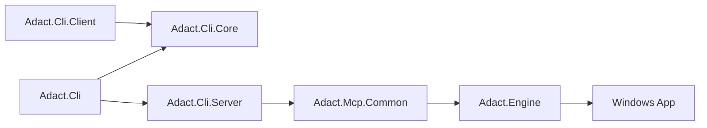

# Components

ADACT consists of 6 production projects and 4 test projects. The production side is split into the CLI, MCP daemon host, MCP common layer, and UIA Engine.

For a fuller picture, see [overview.md](overview.md) for the full flow, [class-responsibilities.md](class-responsibilities.md) for class relationships, [command-flows.md](command-flows.md) for subcommand flow, and [snapshot-pipeline.md](snapshot-pipeline.md) for snapshot/ref conversion.

## Production projects

| Project | Responsibility | Main types |
| --- | --- | --- |
| `src/Adact.Cli/` | `adact.exe` entry point; CLI client, `serve` startup, Skill install, and CLI output conversion | `Program`, `*Command` |
| `src/Adact.Cli.Client/` | Cross-platform CLI entry point | `Program` |
| `src/Adact.Cli.Core/` | Shared library for CLI commands, connection, and output conversion | `*Command`, `NamedPipeMcpClient`, `AdactMcpClient`, `ConnectionResolver`, `SnapshotTextFormatter`, `KeyValueWriter`, `TsvWriter` |
| `src/Adact.Cli.Server/` | HTTP / Named Pipe MCP daemon host | `HttpHost`, `HttpDaemonControl`, `NamedPipeHost`, `NamedPipeDaemonControl` |
| `src/Adact.Engine/` | Real Windows UIA implementation on top of FlaUI.UIA3 | `UiaEngine`, `WindowSession`, `SnapshotBuilder`, `RefRegistry`, `InteractiveSessionGuard`, and supporting value types/exceptions |
| `src/Adact.Mcp.Common/` | MCP tool implementation and session/ref management | `WindowsTools`, `SessionStore`, `WindowRefStore`, `ToolErrors` |

## Test projects

| Project | Main target |
| --- | --- |
| `tests/Adact.Engine.Tests/` | Engine unit/integration/UIA/smoke |
| `tests/Adact.Cli.Tests/` | CLI commands, snapshot formatter, connection, Skill install, CLI E2E |
| `tests/Adact.Mcp.Common.Tests/` | MCP tools, lifecycle, WindowRefStore |
| `tests/Adact.Mcp.Http.Tests/` | HTTP daemon smoke / E2E |

## Major classes

This section highlights the main entry classes across projects. For details on what each class stores, calls, and returns, see [class-responsibilities.md](class-responsibilities.md). Subcommand flow lives in [command-flows.md](command-flows.md), and snapshot/ref details live in [snapshot-pipeline.md](snapshot-pipeline.md).

| Type | Project | Role |
| --- | --- | --- |
| `UiaEngine` | `Adact.Engine` | Enumerates top-level windows, attaches by HWND, and serializes Engine-wide UIA operations |
| `WindowSession` | `Adact.Engine` | Provides snapshot/click/fill/close/kill for one window and holds the session-scoped `RefRegistry` |
| `SessionStore` | `Adact.Mcp.Common` | Tracks `WindowSession` instances in the daemon process by `s<n>` and keeps the active session |
| `WindowRefStore` | `Adact.Mcp.Common` | Issues `w<n>` values for top-level windows and ties together the window list and attach flow |
| `WindowsTools` | `Adact.Mcp.Common` | Implements MCP tools such as `adact_list_windows` and maps Engine exceptions to MCP tool errors |
| `HttpHost` | `Adact.Cli.Server` | Builds and starts the `/mcp` HTTP daemon with ASP.NET Core + MCP SDK |
| `NamedPipeHost` | `Adact.Cli.Server` | Builds and starts the workspace-derived Named Pipe daemon |

## UIA operation serialization

UIA operations are sensitive to foreground, focus, and window state, so ADACT serializes UIA work inside the daemon.

| Layer | Serialization policy |
| --- | --- |
| `UiaEngine` | Keeps a `SemaphoreSlim` and serializes window enumeration and attach |
| `WindowSession` | Shares the same gate from the Engine and serializes snapshot/click/fill/close/kill |
| `SessionStore` | Takes a separate lock at the MCP tool entry point to prevent concurrent tool execution |

This still allows multiple sessions to exist, but UIA calls run one at a time inside the daemon process. The design favors stability over speed.

## State ownership

| State | Owner | Lifecycle |
| --- | --- | --- |
| `windowRef` (`w<n>`) | `WindowRefStore` | Lives in the daemon process; becomes retired when the window disappears from the list |
| `sessionId` (`s<n>`) | `SessionStore` | Created on attach and removed on detach/close/kill/daemon-stop |
| `elementRef` (`s<sid>e<eid>`) | `WindowSession` `RefRegistry` | Session-local; maps to current snapshot elements and reuses refs for the same RuntimeId |
| snapshot file | CLI (`SnapshotFileWriter`) | Saved as `.txt` under `.adact/` or `--snapshot-dir` during CLI runs |

## Dependency direction

This section separates build-time `ProjectReference` dependencies from runtime call flow and design-time call dependencies.

### ProjectReference / build-time dependency

| From | To | Purpose |
| --- | --- | --- |
| `Adact.Cli` | `Adact.Cli.Server` | Start `adact serve http` or `adact serve pipe` |
| `Adact.Cli` | `Adact.Engine` | Current csproj reference; not called directly on the normal CLI client path |
| `Adact.Cli` | `Adact.Mcp.Common` | Current csproj reference; normal operation goes through MCP transport |

| `Adact.Cli.Server` | `Adact.Mcp.Common`, `Adact.Engine` | HTTP / Named Pipe daemon DI setup |

| `Adact.Mcp.Common` | `Adact.Engine` | UIA operation calls and exception mapping |

### Runtime call flow / design dependency

| From | To | Purpose |
| --- | --- | --- |
| CLI command | `AdactMcpClient` | After validating arguments, passes the MCP tool name and arguments |
| `AdactMcpClient` / `NamedPipeMcpClient` | MCP daemon (`Adact.Cli.Server`) | Calls the tool over HTTP or Named Pipe transport |
| MCP daemon | `WindowsTools` (`Adact.Mcp.Common`) | Dispatches to the MCP tool implementation |
| `WindowsTools` | `Adact.Engine` | UIA operation calls and exception mapping |

The normal CLI client subcommand path is `NamedPipeMcpClient` -> MCP daemon -> `WindowsTools` -> Engine, with `AdactMcpClient` used when `--server` selects HTTP. `Adact.Cli` still references `Adact.Cli.Server`, `Adact.Engine`, and `Adact.Mcp.Common` at build time, but normal operation goes through MCP transport rather than direct Engine or MCP common calls.

## References

| Document | Description |
| --- | --- |
| [class-responsibilities.md](class-responsibilities.md) | Layered class responsibilities, state, call targets, and dependency direction |
| [command-flows.md](command-flows.md) | CLI -> MCP -> Store -> Engine -> CLI output flow for `adact <subcommand>` |
| [snapshot-pipeline.md](snapshot-pipeline.md) | Raw JSON generation, ref registration, and CLI `.txt` snapshot conversion |
| [../spec/ref-ids.md](../spec/ref-ids.md) | Ref/session formats and invalidation rules |
| [../spec/mcp-tools.md](../spec/mcp-tools.md) | Tools exposed by `WindowsTools` |
| [../development/testing.md](../development/testing.md) | Test projects and Layer traits |
