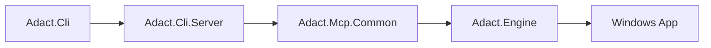

# Components

ADACT は 4 つの production project と 4 つの test project で構成されています。production 側は CLI、HTTP host、MCP 共通層、UIA Engine に分かれます。

詳細な図解は、全体経路は [overview.md](overview.md)、クラス間の関係は [class-responsibilities.md](class-responsibilities.md)、サブコマンドの処理順は [command-flows.md](command-flows.md)、snapshot/ref の変換は [snapshot-pipeline.md](snapshot-pipeline.md) を参照してください。

## Production projects

| Project | 責務 | 主な型 |
| --- | --- | --- |
| `src/Adact.Cli/` | `adact.exe` の entry point。CLI client、`serve` 起動、Skill install、CLI 出力変換 | `Program`, `*Command`, `AdactMcpClient`, `SnapshotTextFormatter` |
| `src/Adact.Cli.Server/` | HTTP MCP daemon の host | `HttpHost`, `HttpDaemonControl` |
| `src/Adact.Engine/` | FlaUI.UIA3 による Windows UIA 操作の実体 | `UiaEngine` (partial: `UiaEngine.cs`, `UiaEngine.Launch.cs`, `UiaEngine.WaitForWindow.cs`)、`WindowSession` (partial: `WindowSession.cs`, `WindowSession.{Mouse,Keyboard,Toggle,Window,Inspect,Wait,Screenshot}.cs`)、`SnapshotBuilder`, `RefRegistry`, `InteractiveSessionGuard`、Phase 8 で追加された `MouseTarget`, `WaitForState`, `WaitForElementQuery`, `WaitForResult`, `WindowSearchQuery`, `LaunchRequest`, `LaunchResult`, `InspectResult`, `ScreenshotResult` 等の値型と `Exceptions/{LaunchFailedException,WaitTimeoutException}` |
| `src/Adact.Mcp.Common/` | MCP tool 実装と session/ref 管理 | `WindowsTools` (partial: `WindowsTools.cs`, `WindowsTools.{Mouse,Keyboard,Toggle,Window,Inspect,Wait,Launch,Screenshot}.cs`)、`SessionStore`, `WindowRefStore`, `ToolErrors` |

## Test projects

| Project | 主な対象 |
| --- | --- |
| `tests/Adact.Engine.Tests/` | Engine の unit/integration/UIA/smoke |
| `tests/Adact.Cli.Tests/` | CLI command、snapshot formatter、connection、Skill install、CLI E2E |
| `tests/Adact.Mcp.Common.Tests/` | MCP tools、lifecycle、WindowRefStore |
| `tests/Adact.Mcp.Http.Tests/` | HTTP daemon smoke / E2E |

## 主要クラス

この節は project をまたぐ入口として主要クラスだけを抜粋します。各クラスが何を保持し、何を呼び、何を返すかの詳細は [class-responsibilities.md](class-responsibilities.md) を参照してください。subcommand 実行時の流れは [command-flows.md](command-flows.md)、snapshot/ref の詳細は [snapshot-pipeline.md](snapshot-pipeline.md) に分けています。

| 型 | 所属 | 役割 |
| --- | --- | --- |
| `UiaEngine` | `Adact.Engine` | top-level window の列挙、HWND attach、Engine 全体の UIA 操作直列化を担う |
| `WindowSession` | `Adact.Engine` | 1 window に対する snapshot / click / fill / close / kill を提供し、session scope の `RefRegistry` を保持する |
| `SessionStore` | `Adact.Mcp.Common` | MCP daemon process 内の `WindowSession` を `s<n>` で管理し、active session を保持する |
| `WindowRefStore` | `Adact.Mcp.Common` | top-level window に `w<n>` を払い出し、window 一覧と attach をつなぐ |
| `WindowsTools` | `Adact.Mcp.Common` | `windows_list_apps` などの MCP tools を実装し、Engine 例外を MCP tool error に変換する |
| `HttpHost` | `Adact.Cli.Server` | ASP.NET Core + MCP SDK で `/mcp` HTTP daemon を構築・起動する |

## UIA 操作の直列化

UIA 操作は foreground / focus / window state の影響を受けやすいため、ADACT は daemon 内の UIA 操作を直列化します。

| 層 | 直列化方針 |
| --- | --- |
| `UiaEngine` | Engine 内部に `SemaphoreSlim` を持ち、window 列挙・attach を直列化する |
| `WindowSession` | Engine から渡された同じ gate を共有し、snapshot / click / fill / close / kill を直列化する |
| `SessionStore` | MCP tool 呼び出しの入口で別の lock を取り、tool レベルでも同時実行を抑える |

このため複数 session は保持できますが、実際の UIA 呼び出しは daemon process 内で 1 本ずつ実行されます。これは速度より安定性を優先した設計です。

## 状態の持ち方

| 状態 | 所有者 | ライフサイクル |
| --- | --- | --- |
| `windowRef` (`w<n>`) | `WindowRefStore` | daemon process 内。window が list から消えると retired になる |
| `sessionId` (`s<n>`) | `SessionStore` | attach で作成、detach/close/kill/close-all/daemon-stop で削除 |
| `elementRef` (`s<sid>e<eid>`) | `WindowSession` の `RefRegistry` | session 内。snapshot で現 snapshot の要素に対応し、同一 RuntimeId は ref を再利用する |
| snapshot file | CLI (`SnapshotFileWriter`) | CLI 実行時に `.adact/` または `--snapshot-dir` へ `.txt` として保存 |

## 依存方向

この節では、`ProjectReference` による build-time dependency と、実行時の runtime call flow / 設計上の呼び出し依存を分けて扱います。

### ProjectReference / build-time dependency

| From | To | 用途 |
| --- | --- | --- |
| `Adact.Cli` | `Adact.Cli.Server` | `adact serve` 起動 |
| `Adact.Cli` | `Adact.Engine` | 現行 csproj 上の参照。通常 CLI client 操作の主経路では直接呼ばない |
| `Adact.Cli` | `Adact.Mcp.Common` | 現行 csproj 上の参照。通常操作の主経路は HTTP MCP 経由 |

| `Adact.Cli.Server` | `Adact.Mcp.Common`, `Adact.Engine` | HTTP daemon の DI 構成 |

| `Adact.Mcp.Common` | `Adact.Engine` | UIA 操作呼び出しと例外変換 |

### Runtime call flow / design dependency

| From | To | 用途 |
| --- | --- | --- |
| CLI command | `AdactMcpClient` | 引数検証後、MCP tool 名と arguments を渡す |
| `AdactMcpClient` | HTTP daemon (`Adact.Cli.Server`) | HTTP transport で tool を呼び出す |
| HTTP daemon | `WindowsTools` (`Adact.Mcp.Common`) | MCP tool 実装へ dispatch する |
| `WindowsTools` | `Adact.Engine` | UIA 操作呼び出しと例外変換 |

通常の CLI client サブコマンドの主経路は `AdactMcpClient` -> HTTP daemon -> `WindowsTools` -> Engine です。`Adact.Cli` は build-time dependency として `Adact.Cli.Server` / `Adact.Engine` / `Adact.Mcp.Common` へ `ProjectReference` を持ちますが、通常操作では Engine や MCP common を直接呼ぶ経路ではなく HTTP MCP 経由で進みます。

## 参照

| 文書 | 内容 |
| --- | --- |
| [class-responsibilities.md](class-responsibilities.md) | 層別の主要クラス責務、状態、呼び出し先、依存方向 |
| [command-flows.md](command-flows.md) | `adact <subcommand>` 実行時の CLI -> MCP -> Store -> Engine -> CLI 出力の流れ |
| [snapshot-pipeline.md](snapshot-pipeline.md) | raw JSON 生成、ref 登録、CLI `.txt` snapshot 変換の詳細 |
| [../spec/ref-ids.md](../spec/ref-ids.md) | ref / session の形式と失効条件 |
| [../spec/mcp-tools.md](../spec/mcp-tools.md) | `WindowsTools` が公開する tool |
| [../development/testing.md](../development/testing.md) | test project と Layer Trait |
