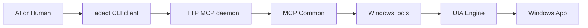

# ADACT 全体像

ADACT は、AI エージェントまたは人間が CLI から Windows デスクトップアプリを操作するための階層型ツールです。現行仕様では、Coding AI が MCP プロトコルを直接話すことを主経路にせず、`adact <subcommand>` を shell から実行する形を主インターフェースにしています。



## 実行経路

通常の操作経路は次の通りです。

```text
AI / Human
  -> adact CLI client (`adact <subcommand>`)
  -> HTTP MCP daemon (`adact serve`, /mcp)
  -> UIA Engine (FlaUI.UIA3)
  -> Windows app
```

| 層 | 実体 | 役割 |
| --- | --- | --- |
| AI / Human | GitHub Copilot、Claude Code、人間の shell など | `adact list-windows` や `adact click <ref>` を実行する |
| CLI client | `src/Adact.Cli/` | 短命プロセス。HTTP MCP daemon に接続し、stdout/stderr を token-efficient な CLI 出力へ変換する |
| HTTP daemon | `adact serve` / `src/Adact.Cli.Server/` | `/mcp` で MCP tools を公開し、session/ref 状態をメモリ内に保持する |
| MCP Common | `src/Adact.Mcp.Common/` | `windows_*` tools、`SessionStore`、`WindowRefStore`、tool error 変換を提供する |
| Engine | `src/Adact.Engine/` | UIA による window 列挙、attach、snapshot、click、fill、close、kill を実行する |
| Windows app | UIA 対応アプリ | WPF / WinForms / UWP / Win32 などの操作対象 |

## コンポーネント関係

| コンポーネント | 関係 |
| --- | --- |
| CLI client | `AdactMcpClient` で HTTP daemon に接続し、MCP tool の結果を CLI 出力に変換する |
| HTTP daemon | `HttpHost` が ASP.NET Core + MCP SDK で `/mcp` を公開する |

| Engine | `UiaEngine` と `WindowSession` が UIA 操作の実体を担う |
| MCP Common | HTTP daemon の tool 実装を提供する |

`adact serve` は Engine と `WindowsTools` を使います。CLI client が接続するのは HTTP daemon です。

## 主インターフェース

ADACT の現在の主インターフェースは `adact <subcommand>` CLI です。

| 操作 | 主に使う入口 |
| --- | --- |
| window 一覧取得 | `adact list-windows` |
| window への attach | `adact attach ...` |
| UI tree の取得 | `adact snapshot` |
| 要素操作 | `adact click <ref>` / `adact fill <ref> <text>` |
| lifecycle | `adact detach` / `adact close-window` / `adact kill` / `adact close-all` / `adact daemon-stop` |
| MCP 互換 | `adact serve` の `/mcp` |

古い検討文書では generation 付き ref (`s<sid>g<gen>e<eid>`) や MCP 直接利用が強く書かれている箇所があります。現行実装では generation は廃止済みで、CLI 主導の運用を前提にします。

## 参照

| 種別 | 文書 |
| --- | --- |
| 要件再整理 | [../../discussion/008_要件再整理.md](../../discussion/008_要件再整理.md) |
| Phase 5 完了 | [../../discussion/010_Phase5_完了.md](../../discussion/010_Phase5_完了.md) |
| Runtime modes | [runtime-modes.md](runtime-modes.md) |
| Component details | [components.md](components.md) |
