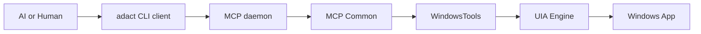

# ADACT Overview

ADACT is a layered tool for letting AI agents or humans control Windows desktop apps from the CLI. In the current design, the main path is running `adact <subcommand>` from a shell instead of speaking MCP directly.



## Execution path

The normal path is:

```text
AI / Human
  -> adact CLI client (`adact <subcommand>`)
  -> MCP daemon (`adact serve pipe` by default, `adact serve http` for `--server`)
  -> UIA Engine (FlaUI.UIA3)
  -> Windows app
```

| Layer | Implementation | Role |
| --- | --- | --- |
| AI / Human | GitHub Copilot, Claude Code, or a human shell | Runs commands such as `adact list-windows` and `adact click <ref>` |
| CLI client | `src/Adact.Cli/` (Windows) / `src/Adact.Cli.Client/` (cross-platform) | Short-lived process that connects to the MCP daemon and turns results into compact CLI output |
| MCP daemon | `adact serve http` / `adact serve pipe` / `src/Adact.Cli.Server/` | Exposes MCP tools and keeps session/ref state in memory |
| MCP Common | `src/Adact.Mcp.Common/` | Provides `adact_*` tools, `SessionStore`, `WindowRefStore`, and tool error mapping |
| Engine | `src/Adact.Engine/` | Performs UIA window enumeration, attach, snapshot, click, fill, close, and kill |
| Windows app | UIA-capable app | The target app, such as WPF, WinForms, UWP, or Win32 |

## Component relationships

| Component | Relationship |
| --- | --- |
| CLI client | Connects to the daemon through `NamedPipeMcpClient` by default or `AdactMcpClient` when `--server` is set, then converts MCP tool results into CLI output |
| HTTP daemon | `HttpHost` exposes `/mcp` through ASP.NET Core + MCP SDK |
| Named Pipe daemon | `NamedPipeHost` exposes the same MCP tool set over a workspace-derived pipe |

| Engine | `UiaEngine` and `WindowSession` provide the actual UIA operations |
| MCP Common | Provides the daemon's tool implementations |

`adact serve http` and `adact serve pipe` use the Engine and `WindowsTools`. The CLI client connects to the daemon.

## Primary interface

The current primary interface is the `adact <subcommand>` CLI.

| Operation | Main entry point |
| --- | --- |
| List windows | `adact list-windows` |
| Attach to a window | `adact attach ...` |
| Get UI tree | `adact snapshot` |
| Interact with an element | `adact click <ref>` / `adact fill <ref> <text>` |
| Lifecycle | `adact detach` / `adact close-window` / `adact kill` / `adact daemon-stop` |
| MCP compatibility | `/mcp` on `adact serve http` |

Older design notes may still mention generation-based refs (`s<sid>g<gen>e<eid>`) or direct MCP use. The current implementation has removed generation and assumes CLI-led operation.

## References

| Type | Document |
| --- | --- |
| Runtime modes | [runtime-modes.md](runtime-modes.md) |
| Component details | [components.md](components.md) |
