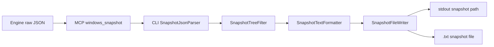
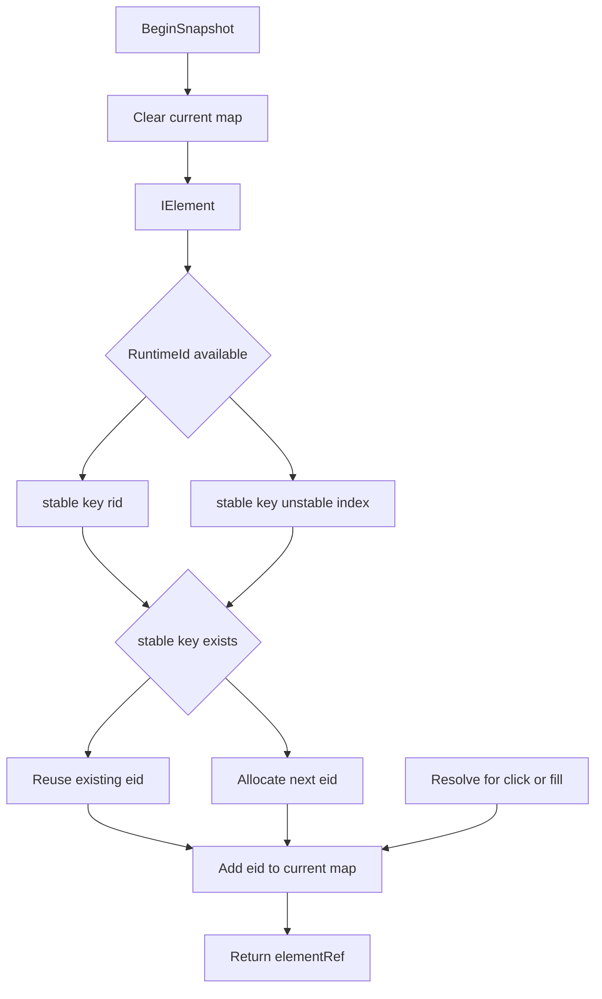

# Snapshot Pipeline

この文書は、ADACT の snapshot が Engine raw JSON から CLI `.txt` snapshot になるまでの設計を説明します。snapshot のフィールド仕様は [../spec/snapshot.md](../spec/snapshot.md)、ref ID の形式は [../spec/ref-ids.md](../spec/ref-ids.md) を参照してください。

## 境界の考え方

| 境界 | 生成物 | 所有者 | 目的 |
| --- | --- | --- | --- |
| Engine / MCP | raw snapshot JSON | `WindowSession.SnapshotAsync()`、`SnapshotBuilder.Build()`、`windows_snapshot` | UIA から取得できる情報をできるだけ落とさず返す |
| CLI | `.txt` snapshot | `CommandHelpers.WriteSnapshotResultAsync()`、`SnapshotJsonParser`、`SnapshotTreeFilter`、`SnapshotTextFormatter`、`SnapshotFileWriter` | AI / 人間が読みやすく、操作に必要な ref を見つけやすい形にする |

Phase 7 以降、Engine は `operable` / `raw` のフィルタ選択を持ちません。Engine と MCP は raw JSON を返し、CLI が filter と field selection を担当します。

## データフロー概要

| データ | 発生源 | 経由 | 消費先 |
| --- | --- | --- | --- |
| `windowRef` (`w<n>`) | `WindowRefStore.SyncOrAssign()` | `list-apps` stdout、`windows_attach` arguments / response | window への attach と idempotent attach |
| `sessionId` (`s<n>`) | `UiaEngine` が `WindowSession` 作成時に採番し、`SessionStore.Register()` が文字列化 | MCP response `_meta.sessionId`、CLI stdout、element ref prefix | snapshot 対象 session、lifecycle、element ref の session 解決 |
| `elementRef` (`s<sid>e<eid>`) | `RefRegistry.Register()` | raw JSON の各 node `ref`、CLI `.txt` snapshot | `click` / `fill` の対象解決 |
| raw JSON | `SnapshotBuilder.Build()` | MCP `windows_snapshot` response | CLI parser / filter / formatter |
| `.txt` snapshot | `SnapshotTextFormatter` と `SnapshotFileWriter` | `.adact/` または `--snapshot-dir` | AI / 人間が次の操作 ref を読む |

## Engine 側: `WindowSession.SnapshotAsync`

1. `WindowsTools.SnapshotAsync()` が対象 `WindowSession` を取得し、`session.SnapshotAsync(options: null)` を呼びます。
2. `WindowSession` は Engine と共有の gate を取ります。これにより snapshot 中に他の UIA 操作が割り込まないようにします。
3. `DetectModalElements()` が、対象 window と同じ process に属し、owner が main window で、main window が disabled の visible window を modal sibling として検出します。
4. `SnapshotBuildInput` に root `IElement`、modal siblings、`SnapshotOptions`、window title、process name、process id、generatedAt を詰めます。
5. `SnapshotBuilder` を session の `RefRegistry` で作成し、`Build(input)` を呼びます。
6. 成功すると `SnapshotResult` が raw JSON、`sessionId`、window/process metadata、generatedAt を持って返ります。
7. snapshot 構築中の想定外例外は `SnapshotException` に包まれ、MCP 層で `SNAPSHOT_FAILED` に変換されます。

## Engine 側: `SnapshotBuilder.Build`

`SnapshotBuilder` は `IElement` tree を DFS で raw JSON に変換します。

| 処理 | 内容 |
| --- | --- |
| snapshot 開始 | `RefRegistry.BeginSnapshot()` を呼び、current snapshot の eid -> element map をクリアする |
| depth guard | `SnapshotOptions.MaxDepth` が正ならそれを使い、未指定相当なら既定 64 を使う |
| node 生成 | 各 `IElement` から role、name、automationId、className、enabled/offscreen、value、helpText、boundingRect、keyboard focus、children を読む |
| ref 付与 | node ごとに `RefRegistry.Register(el, positionalIndex)` を呼び、`s<sid>e<eid>` を `ref` に入れる |
| modal 追加 | modal siblings は root window の追加 child として入れ、`isModalDialog=true` を付ける |
| meta 付与 | `_meta` に options、generatedAt、sessionId、windowTitle、processName、processId、modalDialog summary を入れる |
| 出力 | `{"_meta": ..., "tree": ...}` の raw JSON 文字列と `sessionId` を返す |

raw JSON はフィルタしません。offscreen 要素、構造要素、boundingRect なども Engine で読める範囲では保持されます。

## RefRegistry: stable key と current map

`RefRegistry` は session scope の element ref 管理です。

| 内部状態 | 目的 |
| --- | --- |
| `_stableKeyToEid` | snapshot をまたいで同一要素に同じ eid を再利用する |
| `_byElementIdInCurrentSnapshot` | `click` / `fill` 時に、直近 snapshot に存在した eid だけを `IElement` に解決する |
| `_nextEid` | 新しい stable key に単調増加の eid を割り当てる |

1. `BeginSnapshot()` は `_byElementIdInCurrentSnapshot` だけをクリアします。過去の stable key -> eid は残ります。
2. `Register()` は `IElement.RuntimeId` が取れる場合は `rid:<runtime-id>` を stable key にします。
3. RuntimeId が取れない要素は DFS 出現順の `positionalIndex` を `unstable:<index>` として使います。
4. stable key が既存なら同じ eid を再利用し、新規なら `_nextEid` から採番します。
5. current map には、今回の snapshot で実際に見えた eid と `IElement` を登録します。
6. `Resolve(refId)` は ref 形式、session mismatch、current map に存在するかを確認します。古い snapshot 由来で current map にない eid は `RefNotFoundException` になります。

この設計により、RuntimeId が安定している要素は snapshot 後も同じ ref を保ちつつ、操作対象は直近 snapshot に存在する要素に限定されます。

## MCP `windows_snapshot`

1. `WindowsTools.SnapshotAsync()` は `SessionStore.AcquireAsync()` で tool-level lock を取ります。
2. `sessionId` が省略された場合は `SessionStore.GetActiveOrNull()` を使います。active session がなければ `NO_ACTIVE_SESSION` です。
3. `sessionId` が指定された場合は `SessionStore.TryGet()` で `WindowSession` を取得します。存在しなければ `INVALID_ARGUMENT` です。
4. `WindowSession.SnapshotAsync()` の raw JSON を `CallToolResult.Content[0].Text` に入れます。
5. 同じ raw JSON を deserialize し、`StructuredContent` にも入れます。

MCP tool としての `windows_snapshot` は raw JSON を返すだけです。CLI `.txt` のフィルタ、整形、保存先 path は知りません。

## CLI `WriteSnapshotResultAsync`

`CommandHelpers.WriteSnapshotResultAsync()` は、`snapshot` command、`attach` 成功後の自動 snapshot、および Phase 8 で追加された auto-snapshot 対象コマンド (`click`, `fill`, `dblclick`, `hover`, `type`, `press`, `check`, `uncheck`, `select`, `clear`, `mouse-wheel`, `resize`, `minimize`, `maximize`, `restore`) 成功後の自動 snapshot から共通利用されます。

1. filter 未指定なら `operable` にし、`SnapshotTreeFilter.IsKnownFilter()` で `operable` / `raw` のみ許可します。
2. `sessionId` があれば MCP `windows_snapshot` の arguments に入れ、なければ arguments なしで active session を使います。
3. `McpResponse.TryReportError()` で MCP error を CLI stderr と exit code に変換します。
4. response JSON の `_meta.sessionId` を優先して resolved sessionId を得ます。ない場合は呼び出し側の `sessionId` を使います。
5. raw JSON 文字列は `Content[0].Text` を優先し、なければ parsed JSON の raw text を使います。
6. `SnapshotJsonParser.Parse(raw)` で `_meta` と `tree` を CLI 中間型に変換します。
7. `SnapshotTreeFilter.Apply(root, filter)` で CLI filter を適用します。
8. `SnapshotTextFormatter.Format(meta, filtered, filter)` で `.txt` snapshot を作ります。
9. `SnapshotFileWriter.Write()` が file に保存し、CWD からの相対 path を返します。
10. stdout に `sessionId` と `snapshot <path>` を出します。`attach` から呼ぶ場合は `sessionId` をすでに出しているため、`writeSessionId=false` にします。

## CLI parser / filter / formatter / writer

| 型 | 入力 | 出力 | 設計上の役割 |
| --- | --- | --- | --- |
| `SnapshotJsonParser` | Engine raw JSON 文字列 | `SnapshotMeta`、`SnapshotElement` tree | raw JSON と CLI 整形処理を分離する |
| `SnapshotTreeFilter` | `SnapshotElement` tree、filter 名 | filtered tree | UIA の構造ノードを AI が操作しやすい tree にする |
| `SnapshotTextFormatter` | metadata、filtered tree、filter 名 | frontmatter 付き `.txt` 文字列 | Playwright 風の読みやすい snapshot にする |
| `SnapshotFileWriter` | `.txt` 文字列、sid、保存先 | relative snapshot path | CLI 実行ごとの成果物を `.adact/` 等に保存する |

`raw` filter は tree 構造をそのまま残します。ただし `.txt` として出すため、表示フィールドは `SnapshotTextFormatter` が扱う項目に絞られます。完全な raw 情報が必要な場合の canonical source は MCP `windows_snapshot` の raw JSON です。

`operable` filter は、button/edit/menu item など操作対象として意味のある ControlType を残し、無名の `Pane` / `Group` / `Custom` などの構造要素は flatten します。`IsOffscreen=true` の要素は子孫ごと除外します。root window は常に保持します。

## auto-snapshot 対象コマンドと操作後 snapshot

`click` / `fill` を含む状態変化系コマンドは、操作が UI を変える可能性が高いため、CLI 側で成功後に snapshot を自動取得します。

| 分類 | コマンド | auto-snapshot |
| --- | --- | --- |
| 状態変化系 | `click`, `fill`, `dblclick`, `hover`, `type`, `press`, `check`, `uncheck`, `select`, `clear`, `mouse-wheel`, `resize`, `minimize`, `maximize`, `restore` | あり (`--no-snapshot` で抑止可) |
| 低レベル補助 | `mouse-move`, `mouse-down`, `mouse-up`, `key-down`, `key-up`, `focus`, `scroll-into-view` | なし |
| 取得・同期系 | `inspect`, `screenshot`, `wait-for`, `wait-for-window`, `launch` | なし |

`click` / `fill` の流れを例にすると次のようになります。

1. CLI は操作前に element ref 形式を検証します。
2. MCP `windows_click` / `windows_fill` は ref prefix の `s<n>` から session を見つけ、`RefRegistry.Resolve()` で current snapshot の element に解決します。
3. Engine 操作が成功すると MCP tool は空の success result を返します。
4. CLI は `RefValidator.ExtractSessionId(elementRef)` で `s<n>` を取り出します。
5. `--no-snapshot` がなければ、その `sessionId` で `WriteSnapshotResultAsync()` を呼び、操作後の UI tree を保存します。
6. `--no-snapshot` の場合、CLI は操作対象 session の手掛かりとして `sessionId` のみ stdout に出します。

自動 snapshot は MCP tool の中ではなく CLI 側で行います。そのため MCP client が直接 `windows_click` を呼んだ場合は、必要に応じて client 側で `windows_snapshot` を追加で呼びます。

## ref の寿命と失敗点

| ref | 所有者 | 有効範囲 | 代表的な失敗 |
| --- | --- | --- | --- |
| `windowRef` | `WindowRefStore` | daemon process 内。list から消えると retired | retired / unknown `w<n>` は `INVALID_WINDOW_REF` |
| `sessionId` | `SessionStore` | attach から detach/close/kill/close-all/daemon-stop まで | unknown `s<n>` は snapshot では `INVALID_ARGUMENT`、lifecycle では `NOT_FOUND` |
| `elementRef` | `WindowSession.RefRegistry` | session 内。操作解決は current snapshot に存在する eid のみ | malformed / 別 session / current snapshot 不在は `REF_NOT_FOUND` |

`elementRef` は sessionId を含むため、MCP `windows_click` / `windows_fill` は active session に依存しません。一方で `snapshot` と lifecycle は `sessionId` 省略時に active session を使います。

## 関連文書

| 文書 | 内容 |
| --- | --- |
| [command-flows.md](command-flows.md) | subcommand 全体の処理フロー |
| [class-responsibilities.md](class-responsibilities.md) | snapshot 関連クラスを含む責務一覧 |
| [../spec/snapshot.md](../spec/snapshot.md) | snapshot フィールド仕様 |
| [../spec/ref-ids.md](../spec/ref-ids.md) | ref ID 仕様 |